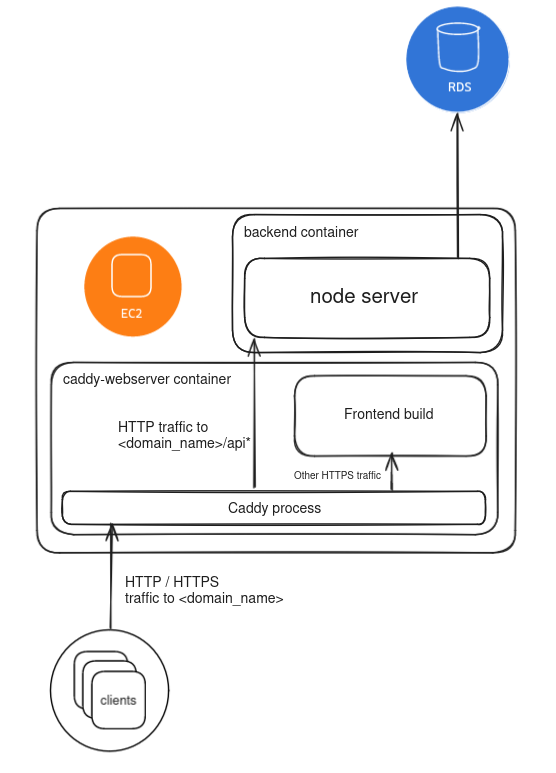

# fullstack-monorepo-starter

[](https://github.com/gregory-artaud/fullstack-monorepo-starter/actions/workflows/ci.yml)

## Requirements

`docker` and `docker compose` are needed to run this project.

## How to set up

```bash
pnpm install
```

## How to launch development environment

Firstly fill the needed `.env` files in the different apps:

- backend

In a terminal run

```bash
pnpm run dev
```

This launches a postgres instance in docker and build libraries in watch mode.

In another shell run

```bash
pnpm run dev:start
```

## How to deploy

This project is meant to be run on a single VPS (AWS EC2 in the example).
Here is a schema showing what the compose file is deploying when I use this on AWS.



The following instructions are not supposed to be run locally, connect to your deployment machine first.

Clone the project

```bash
git clone https://github.com/gregory-artaud/fullstack-monorepo-starter.git
```

I assume you already have a domain name and added a A record to your deployment machine's IP.

Replace "localhost" by your domain name in the `caddy-webserver`'s `Caddyfile`

```bash
sed -i 's/localhost/<domain_name>/g' docker/caddy-webserver/Caddyfile
```

On the server, run:

```bash
docker compose -f compose.prod.yaml up -d --build
```

## What's next

- [ ] Terraform modules to run EC2 and RDS instances before deploying
- [ ] CD pipeline in Github Actions
