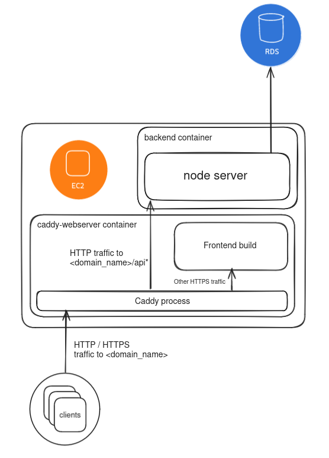

# fullstack-monorepo-starter

[](https://github.com/gregory-artaud/fullstack-monorepo-starter/actions/workflows/ci.yml)

## Requirements

`docker` and `docker compose` : https://docs.docker.com/engine/install/

`transcrypt` : https://github.com/elasticdog/transcrypt

`pnpm` : https://pnpm.io/installation

## How to set up

### Development environment

Make sure you have the right node version

```bash
nvm install
```

Install dependencies

```bash
pnpm install
```

Populate backend `.env` file for development

```bash
cp apps/backend/.env.development apps/backend/.env
```

### Deployment

This assumes you already set up the development evironment

Reset backend `.env.production` file

```bash
cp apps/backend/.env.sample apps/backend/.env.production
```

Reset `transcrypt` configuration

```bash
transcrypt
```

Keep the new secret key, you will need it later

If you want to use the terraform infrastructure, you will need to configure your AWS profile
https://docs.aws.amazon.com/cli/latest/userguide/cli-configure-files.html

## How to launch development environment

In a terminal run

```bash
pnpm run dev
```

This launches a postgres instance in docker and build libraries in watch mode.

In another shell run

```bash
pnpm run dev:start
```

## How to deploy

### Manually

This project is meant to be run on a single VPS (AWS EC2 in the example).
Here is a schema showing what the compose file is deploying when I use this on AWS.



The following instructions are not supposed to be run locally, connect to your deployment machine first.

Clone the project

```bash
git clone https://github.com/gregory-artaud/fullstack-monorepo-starter.git
```

I assume you already have a domain name and added a A record to your deployment machine's IP.

Replace "fullstack-monorepo-starter.gregory-artaud.fr" by your domain name in the `caddy-webserver`'s `Caddyfile`

```bash
sed -i 's/fullstack-monorepo-starter.gregory-artaud.fr/<domain_name>/g' docker/caddy-webserver/Caddyfile
```

Populate `.env.production` with the right values manually

Create the caddy_data external volume

```bash
docker volume create caddy_data
```

Start the app

```bash
docker compose -f compose.prod.yaml up -d --build
```

### Using continuous deployment

I assume you already have a deployment machine, a database instance, a domain name and added a A record to your deployment machine's IP.

If you don't already have the infrastructure, you can use the terraform configuration.
To use it you must install terraform and set up the environment to use aws. (https://developer.hashicorp.com/terraform/tutorials/aws-get-started/aws-build)

Then deploy the infrastructure

```bash
cd terraform
terraform deploy
```

On github, you must set the following secrets

- `TRANSCRYPT_KEY`: the key you got when you set up transcrypt for the repository
- `EC2_PRODUCTION_HOST`: the IP or hostname of your deployment machine
- `EC2_PRODUCTION_SSH_KEY`: the OPENSSH private key to connect to your deployment machine

Replace "fullstack-starter.gregory-artaud.fr" by your domain name in the `caddy-webserver`'s `Caddyfile`

```bash
sed -i 's/fullstack-starter.gregory-artaud.fr/<your_domain_name>/g' docker/caddy-webserver/Caddyfile
```

Push this change to production

```bash
git checkout production
git add .
git commit -m 'chore: changed domain name'
git push
```

Go to `https://<your_domain_name>`, and your app should be deployed.

After that, any push to the production branch will trigger a deploy.

## What's next

- [ ] Dependabot in Github Actions with automerge job
